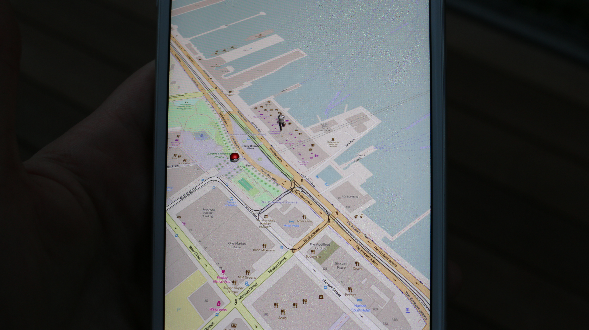

# 004_slippy_maps

This shows you how you can get started to build AR type maps.

Included in this project:

- Assets for Pikachu and Pokeball
- A Unity Plugin to get started.

There are number of map options inside the app including VirtualEarth, OpenStreetMap and more.

## Quick Steps

1. Install Unity
2. Import `PokemonMap.unitypackage`
3. Review the location and map behavior before running the tutorial
4. Open the scene included in the package

### Screenshots

