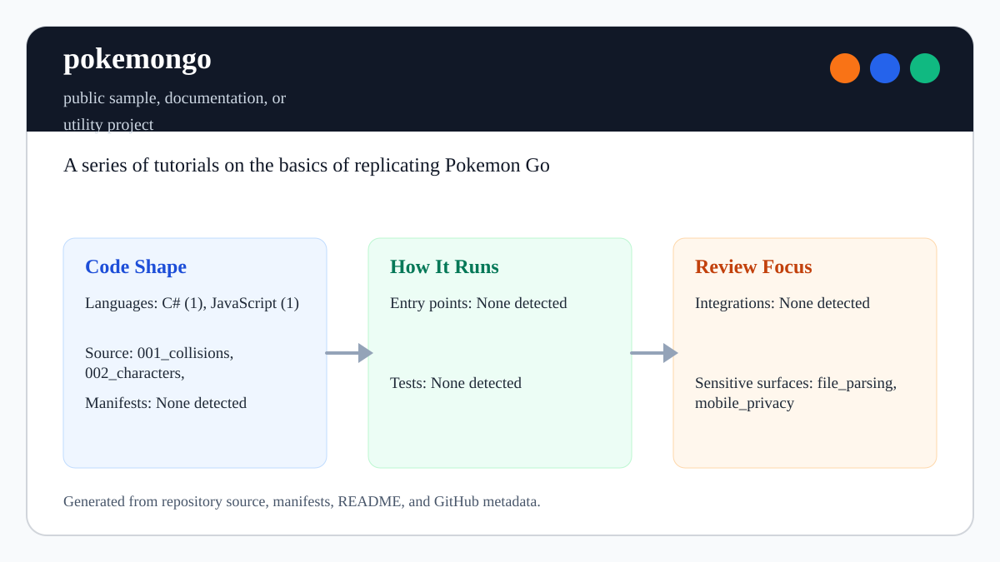

# pokemongo

<!-- README-OVERVIEW-IMAGE -->


## Overview

`garethpaul/pokemongo` is a public sample, documentation, or utility project. A series of tutorials on the basics of replicating Pokémon Go

This README is based on the checked-in source, manifests, scripts, and repository metadata on the `master` branch. The project language mix found during review was: C# (1), JavaScript (1).

## Repository Contents

- `README.md` - project overview and local usage notes
- `001_collisions` - source or example code
- `002_characters` - source or example code
- `003_augmented_reality` - source or example code
- `004_slippy_maps` - source or example code
- `ASSET_NOTICES.md` - asset ownership and fan-project usage notes
- `CHANGES.md` - notable maintenance changes
- `docs/plans` - completed engineering plans in the canonical location
- `Makefile` - local verification entry points
- `.github/workflows/check.yml` - hosted Unity-free tutorial validation
- `TOOLCHAIN.md` - Unity, Blender, AR SDK, and map package assumptions
- `plans` - completed maintenance plans
- `scripts` - deterministic tutorial inventory checks
- `SECURITY.md` - security reporting and disclosure guidance
- `VISION.md` - project direction and maintenance guardrails

Additional scan context:

- Source directories: 001_collisions, 002_characters, 003_augmented_reality, 004_slippy_maps, scripts
- Dependency and build manifests: Makefile
- Entry points or build surfaces: Makefile
- Test-looking files: scripts/check-tutorial-assets.rb

## Getting Started

### Prerequisites

- Git
- Ruby and `make`

### Setup

```bash
git clone https://github.com/garethpaul/pokemongo.git
cd pokemongo
```

The setup commands above are derived from repository files. Legacy mobile, Python, or JavaScript samples may require older SDKs or package versions than a modern workstation uses by default.

## Running or Using the Project

- Start with the numbered tutorial directories in order.
- Review `ASSET_NOTICES.md` before reusing, replacing, or redistributing
  checked-in character, model, screenshot, AR, or map-package assets.
- Check `TOOLCHAIN.md` before opening a tutorial in Unity or Blender.
- Open Unity projects from `001_collisions` and `003_augmented_reality` with a compatible Unity editor.
- Open Blender assets from `002_characters`, and import `004_slippy_maps/PokemonMap.unitypackage` from Unity.
- `screenshots/001.jpg` is a standalone legacy overview screenshot; per-tutorial
  screenshots live under `screenshots/<tutorial-id>/`.

## Testing and Verification

- Run `make check` or `make verify` before committing tutorial structure, screenshot, or asset-reference changes.
- GitHub Actions runs the same dependency-free `make check` gate for every push
  and for pull requests.
- Run `make build` for the static Unity-free tutorial validation gate; it uses
  the same dependency-free validator as `make lint`.
- The verification gate checks README image references, the expected Unity,
  Blender, and Unity package artifacts, per-tutorial screenshot inventory, the
  tutorial screenshot `alt` text, the Unity scene names referenced by tutorial
  READMEs, the top-level toolchain matrix, exact Unity editor versions from
  `ProjectVersion.txt`, archived asset binary file signatures, and asset-notice
  coverage without requiring Unity to be installed.
- Numbered tutorial directories must stay contiguous from `001` and remain
  listed in this top-level README.
- Tutorial READMEs must name their critical setup files, SDKs, and permission
  assumptions so readers do not have to infer them from the top-level matrix.
- Screenshot inventory files must stay non-executable so image assets do not
  carry script-like permissions.
- Archived Blender, Unity package, FBX, and texture assets must also stay
  non-executable so tutorial media cannot carry script-like permissions.
- Unity project files, source files, material files, and `.meta` files must
  also stay non-executable because they are data or source inputs here.
- Every file and directory below a checked-in Unity `Assets` folder must keep
  matching `.meta` metadata, and orphaned metadata is rejected, so Unity GUIDs
  remain stable when the archive is cloned or imported. Metadata GUIDs must
  also use Unity's lowercase 32-hex format and remain unique across projects.
- The validator anchors recursive asset scans to the repository, so it can be
  invoked from any working directory without inspecting unrelated files.
- The same gate protects the hosted workflow's read-only permission, pinned
  credential-free checkout, sole-workflow boundary, ownership routing, and
  canonical command.

When the required SDK or runtime is unavailable, use static checks and source review first, then verify on a machine that has the matching platform toolchain.

## Configuration and Secrets

- No required secret or credential file was identified in the repository scan. If you add integrations later, keep secrets out of git.

## Security and Privacy Notes

- Review changes touching file, media, JSON, XML, CSV, OCR, or data parsing; examples from the scan include 001_collisions/Assets/Scripts/HitObject.cs.

## Maintenance Notes

- See `SECURITY.md` for vulnerability reporting and safe research guidance.
- See `VISION.md` for project direction and contribution guardrails.
- See `TOOLCHAIN.md` for tutorial setup and permission-sensitive assumptions.
- See `ASSET_NOTICES.md` for asset ownership and fan-project usage notes.
- See `CHANGES.md` for maintenance history.
- See `docs/plans/2026-06-08-asset-notices-baseline.md` for the current
  canonical completed engineering plan.
- See `docs/plans/2026-06-08-screenshot-inventory-validation.md` for the
  screenshot inventory guard.
- See `docs/plans/2026-06-09-loose-screenshot-inventory.md` for standalone
  screenshot documentation checks.
- See `docs/plans/2026-06-09-unity-scene-reference-validation.md` for tutorial
  Unity scene-name validation.
- See `docs/plans/2026-06-09-unity-version-toolchain-validation.md` for Unity
  editor-version validation against `TOOLCHAIN.md`.
- See `docs/plans/2026-06-09-screenshot-permission-validation.md` for
  screenshot permission validation.
- See `docs/plans/2026-06-09-tutorial-readme-setup-validation.md` for
  per-tutorial setup assumption validation.
- See `docs/plans/2026-06-09-asset-permission-validation.md` for archived
  tutorial asset permission validation.
- See `docs/plans/2026-06-09-unity-project-permission-validation.md` for Unity
  project file permission validation and the static `make build` gate.
- See `docs/plans/2026-06-09-tutorial-image-alt-validation.md` for tutorial
  screenshot alt-text validation.
- See `docs/plans/2026-06-10-tutorial-sequence-validation.md` for numbered
  tutorial sequence validation.
- See `docs/plans/2026-06-10-hosted-tutorial-validation.md` for hosted checks
  and repository-anchored asset scanning.
- See `docs/plans/2026-06-10-unity-metadata-validation.md` for Unity asset and
  `.meta` pairing validation.
- See `docs/plans/2026-06-12-asset-signature-validation.md` for corruption
  detection on screenshots, Blender projects, FBX models, and Unity packages.
- See `plans/2026-06-08-toolchain-matrix-validation.md` for the current
  toolchain matrix validation baseline.

## Contributing

Keep changes small and tied to the project that is already present in this repository. For code changes, document the toolchain used, avoid committing generated dependency directories or local configuration, and update this README when setup or verification steps change.
